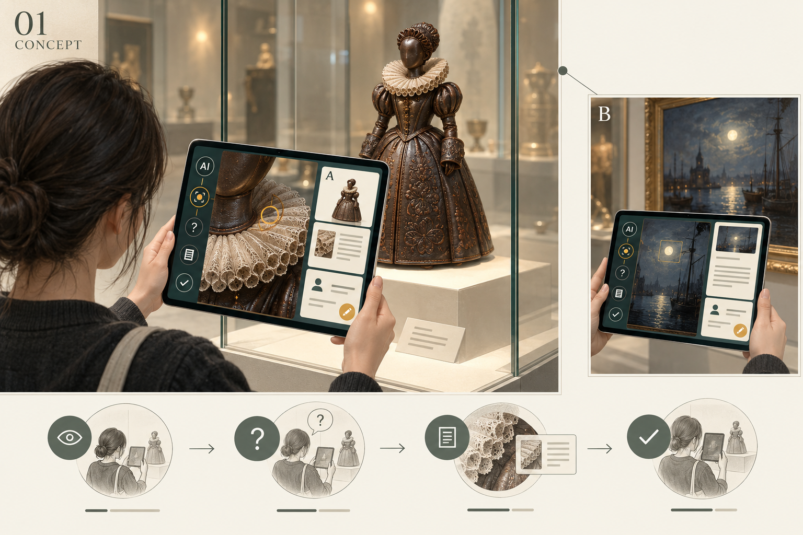
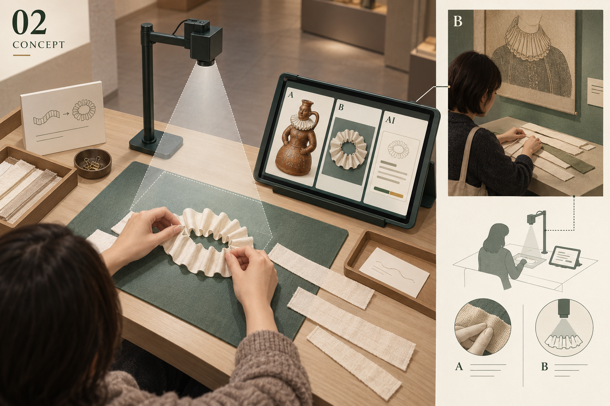
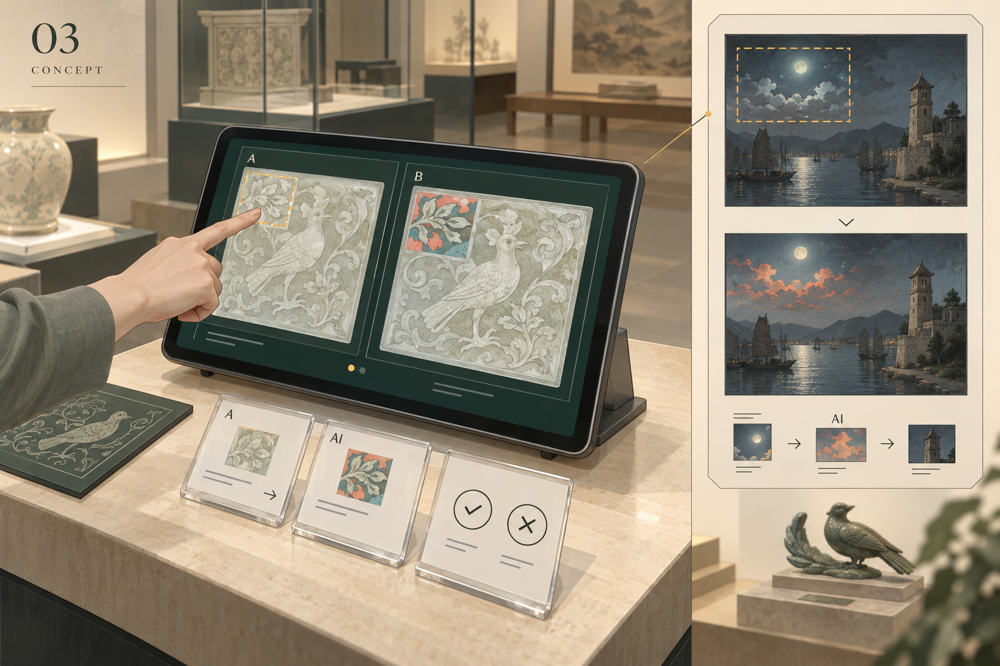
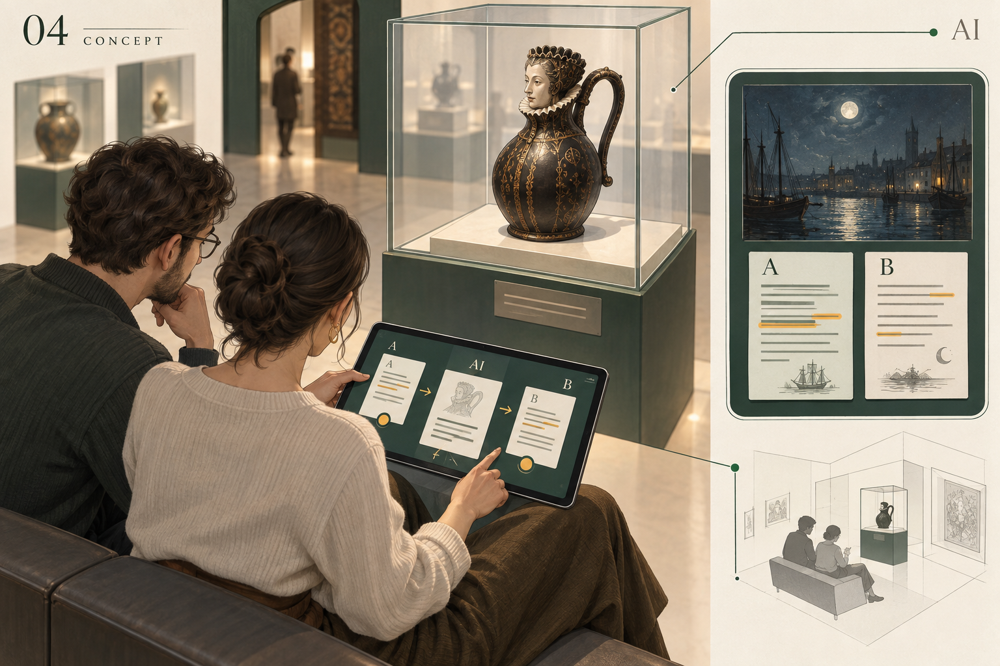
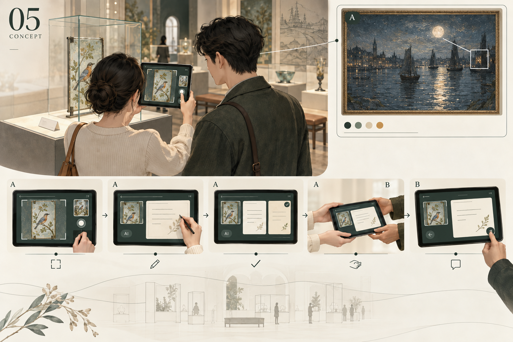

# 五个AI Probe：设计图、两馆对象与研究逻辑

更新：2026-10-02。设计稿；未接入AI或开展参与者研究。

[打开设计图册](index.html)

## 研究问题

**RQ · 主问题：博物馆与遗产场所中的人机互动，如何塑造访客的真实性体验？**

How do human–AI interactions shape visitors’ experiences of authenticity in museums and heritage sites?

**SQ1 · 体验依据：访客在AI中介的遗产相遇中，依托什么形成真实性体验？**

What do visitors draw on to experience authenticity in AI-mediated heritage encounters?

**SQ2 · 互动过程：访客如何在与AI互动时，维持或修订对真实性的理解？**

How do visitors maintain or revise their understandings of authenticity through interaction with AI?

五项为探索性Probe，关注访客如何用对象、过去、身体、个人表达或他人联系形成并修订真实性体验。喜欢、信任、停留时长和知识正确率不能直接代替真实性。建议先选1–2项开展约6–8段会话的小试以校准流程；这不是正式样本量估计。以会话内“原始关注→AI实际输出→人的取舍→解释理由”为分析主线，保留未改变、拒绝与失败事件；双人任务以互动对为单位。两馆对象和媒介不同，不作场馆或文化的因果比较。

## 两馆对象与使用条件

THG两项来自官网馆藏亮点；GHT两项是已核实的历史借展／展览对象，并非已核实的GHT永久馆藏或现展作品。对象范围沿用现有设计的皮革、玻璃与纺织等；若必须严格限定纺织品，THG仍需另选对象。

### THG-LJ · 人物造型皮革酒壶

Tudor House & Garden / Leather Jug / 官网馆藏亮点

馆方将它描述为伊丽莎白时代女士造型的皮革酒壶；裙面有压印纹样，领口等处的皮革种类仍有不确定性。

服饰造型不等于纺织品。编号、研究用高清图与使用条件待确认；不把造型说成伊丽莎白一世本人。

[官方资料](https://tudorhouseandgarden.com/explore/highlights/) · [来源参考图](https://tudorhouseandgarden.com/wp-content/uploads/sites/2/2023/01/Wine-flaggon-Queen-Elizabeth-e1675069963548.jpg)

### THG-GP · 绘鸟玻璃片

Tudor House & Garden / Glass Panes / 官网馆藏亮点

这组绘鸟玻璃片在库房中被发现；馆方提出它们可能来自宴会厅旧窗。

旧窗来源是推测。实施前选定一片、确认编号与高清图；鸟的历史身份不能由模型补写。

[官方资料](https://tudorhouseandgarden.com/explore/highlights/) · [来源参考图](https://tudorhouseandgarden.com/wp-content/uploads/sites/2/2023/02/Tudor-glass-windows-e1675939638746.jpg)

### GHT-MP · 《月光下的God’s House Tower》

God’s House Tower / Abraham Pether · God’s House Tower by Moonlight / Pether 历史借展路线 · 非 GHT 永久馆藏

选用 Abraham Pether 的这幅塔楼月夜画作为具名候选。GHT官网确认Pether家族借展组；2019年开幕报道具体提及这幅作品，图片档案列藏方为 Hampshire County Council’s Fine Art Collection。

图片档案列编号 FA1991.28（须向藏方复核）；本轮未直接读取到 Art UK 条目。GHT展览关系与当前可用性分开：不声称仍在展，研究图像和借用条件待确认。

[官方资料](https://godshousetower.org.uk/about/news/the-moonlight-pethers-have-arrived/) · [来源参考图](https://d3d00swyhr67nd.cloudfront.net/w1200h1200/collection/HMP/HMCMS/HMP_HMCMS_FA1991_28-001.jpg)

[单件题名、编号与图像档案（Commons转载Art UK）](https://commons.wikimedia.org/wiki/File:Abraham_Pether_(1756-1812)_-_God%27s_House_Tower_by_Moonlight_-_FA1991.28_-_Hampshire_County_Council.jpg)

[2019年开幕报道：点名此画与GHT展览的关系](https://www.theartnewspaper.com/2019/10/14/southamptons-new-art-space-takes-over-tower-of-700-year-old-city-gateway)

### GHT-EI · 《Everyone Involved》纺织壁挂

God’s House Tower / Ian Giles · Everyone Involved / 2024 历史展览 · 非已核实 GHT 馆藏

Ian Giles 的2024年展览包含以旧布和找到的纺织材料制作的壁挂；官网说明作品展后将进入 Southampton City Art Gallery 收藏。

该说明不证明各壁挂组件已经入藏，也不证明目前仍在 GHT。选择哪件组件、照片授权与现场可用性需馆方及艺术家确认。

[官方资料](https://godshousetower.org.uk/eventer/exhibition-everyone-involved/) · [来源参考图](https://godshousetower.org.uk/wp-content/uploads/LS-Everyone-Involved-launch-9-scaled.jpg)

## 01 藏品细节侦探镜

**一句话：**在藏品数字照片上点一处，问AI一个问题，再留下自己的解释。

1人＋研究者，约6–8分钟（未实测）。

**观察焦点：**当AI解释一个藏品细节时，访客会依据什么保留或改变自己对这件物品的理解？

**对应RQ：**主要支持SQ1（真实性体验的依据），同时通过前后解释支持SQ2（理解的维持或修订）。

**张力：**我看见的细节、馆方提供的记录、AI给出的解释，可能相互支持，也可能不一致。

### 三步互动

1. **指一处，问一句**：点选皮革酒壶的领口、裙面或其他可见细节；输入自己的疑问。
   - AI：尚不调用；先保存参与者原始观察。
   - 保存：点选坐标、问题原文、最初判断。

2. **AI给一条线索**：读一段不超过80字的回答；可以展开对应馆方资料。
   - AI：多模态语言模型读取所选细节及固定资料卡，返回一条有出处的解释；没有资料就说无法确定。示例只是拟定文案。
   - 保存：实际输入、模型版本、原始回答、引用资料版本及资料展开记录。

3. **钉上你的解释**：选择保留原想法／修改／暂不判断，再写一句原因。
   - AI：不再调用。
   - 保存：前后解释与理由；包括不改变和不认同AI。

### 两馆适配

**Tudor House & Garden / 人物造型皮革酒壶（官网馆藏亮点）**

选取：领口起伏、裙面压印纹样。先看对象图再选一处；例如询问“它看起来像布，为什么是皮革？”AI给资料线索，访客写自己的最终理解。

追问：看起来像衣服，与知道它是酒壶，这两种依据怎样改变你的理解？

边界：摄影输入只能说明你选了哪里；不能据此认定皮革种类或年代。

**God’s House Tower / 《月光下的God’s House Tower》（Pether 历史借展路线 · 非 GHT 永久馆藏）**

选取：塔楼与水面的关系、月光或船只。使用本页所列 Abraham Pether 画作的获准数字图；访客问“画里为什么水离塔这么近？”把画面观察与已核实的场地资料并排。

追问：画面和你所知道的这处场地，分别让你相信了什么？

边界：画作不是历史现场照片；有出处的场地信息与画家的表现要分开。当前用数字资料，不能预设原画仍在展。

### 摄像头与AI

摄像头可选 · 拍一处细节。基础版直接在官方照片上选点。现场允许拍摄且对象在展时，改为后置摄像头取景→访客确认对象→裁出细节→提交一次。使用预先选定的对象事实卡，不做全馆自动识别；反光或模糊时回到官方图。

只在按下快门后保留所选细节；预览不上传，裁剪后确认才送给视觉模型。记录拍摄／图库模式、模糊与失败情况，避免把摄影差异误当成AI效果。

输入＝对象图／选点＋问题＋固定事实卡；输出＝一条简短回答＋支持它的资料条目＋未确定之处。AI不能以制作者或历史人物的口吻虚构第一手经历。

### 案例与设计变化

[Cleveland Museum of Art：Look Closer / Talk to the Art](https://www.clevelandart.org/digital-innovations/investigate)。Look Closer以AR观察细节；Talk to the Art使用语言与语音模型回应访客问题。前者不能单独称为生成式AI案例。

Look Closer提供主动观察细节的交互参考，Talk to the Art提供有策展资料的问答参考。新增的手机快照是本项目适配；并不声称原案例采用相同拍照流程。

### 数据与分析

|保存材料|观察内容|推断边界|
|---|---|---|
|选点＋最初问题|他最初依托的是外观、制作还是用途等线索|点击位置本身不能说明真实性判断。|
|AI原回答＋是否查看依据|人的判断发生在什么信息之后|查看依据不等于信任依据。|
|最终注释＋理由|哪些理解保持、增加或被撤回|若只是记住一个事实，不自动编码为真实性体验变化。|

以一个被点选的细节为单位，串起“原先说法→AI回应→人的最终说法”。先分析具体依据与理由，再比较访客是否把它描述为与物件、过去或制作者更有联系。

**产物：**对象标识｜选点｜我的问题｜AI回答及依据｜我的最终注释｜为什么这样写

**主持：**先让人自由选细节。若不知道问什么，只提示“你想多了解哪一处”，不提供标准问题或暗示AI会说错。最后请其指着自己的注释解释，不要求改变看法。

**最小制作：**低：网页点选＋固定资料上下文＋一次模型请求＋日志。照片分辨率不足时限制到预选细节；AI超时保留原问题并记录失败，不伪造回答。

**试用检查：**能否在清晰图像上自选细节；模型是否保留资料中的不确定性；不改想法的参与者是否也能留下有意义的理由。

**局限：**模型答错可能把活动变成知识纠错；应在分析中标记事实错误引发的反应，区别于对真实性的协商。

## 02 把领子折出来

**一句话：**看着酒壶上的服饰造型，用普通布或纸折一个轮廓，让AI回应你做出的东西。

1–2人＋研究者，约8–10分钟（未实测）。

**观察焦点：**当动手产生的材料感受与AI的视觉解释不同，访客如何理解自己与藏品之间的联系？

**对应RQ：**主要支持SQ1（身体与材料经验能否成为依据），并观察这些经验如何补充或修正AI解释，支持SQ2。

**张力：**AI主要看见轮廓，人还感受到软硬、支撑、阻力和失败；二者不一定描述同一种经验。

### 三步互动

1. **折一个形状**：看领口细节，用一条普通棉布或纸折叠；搭档可帮忙。拍一张只有手工作品的照片，补一句制作感受。
   - AI：尚不调用；不实时追踪手部。
   - 保存：完成后的照片、材料选择与感受原话；不要求拍脸。

2. **AI回应你的尝试**：并排看原图、自己的折形与AI的一条观察。
   - AI：视觉语言模型比较两张图及人的文字，只指出一处可见对应或差异，并提出一个追问；不据照片识别古代纤维或证明工艺。
   - 保存：实际照片输入、文字输入、完整模型输出与引用资料。

3. **你来纠正它**：指出AI说中或没说中的一处；可重新摆放一下并用一句话解释，不再生成。
   - AI：不再调用；人的修正原样保存。
   - 保存：对AI的修正、最终照片（如有）、动作与感受的关系。

### 两馆适配

**Tudor House & Garden / 人物造型皮革酒壶（官网馆藏亮点）**

选取：把领口轮廓折出来。用普通棉布或纸做出领口的一处起伏；拍照并说一句“哪里难做”。AI描述一处视觉对应，访客指出它遗漏的手感。

追问：你的手感，还是AI说的“像”，更影响你理解这件物品？为什么？

边界：普通布纸不是原物材料；这是形状探索，不是历史工艺复原。高清图若不足以看清领口，换为馆方确认可见的边缘。

**God’s House Tower / 《Everyone Involved》纺织壁挂（2024 历史展览 · 非已核实 GHT 馆藏）**

选取：把一处布边、层叠或色块关系摆出来。GHT版将任务改为“把形状做出来”：看一件经确认的壁挂组件，用普通布片摆出一处层叠关系；拍照、描述阻力，再回应AI。

追问：你对材料的感受，如何与你理解这件当代作品的表达联系起来？

边界：不做领子、不临摹档案人物，也不推测参与者身份。需保留作品的社会历史背景；未落实作品／图像可用性前仅为条件适配。

### 摄像头与AI

摄像头核心 · 拍桌面作品。优先用固定俯拍摄像头，或研究者协助持平板拍摄。先自由折形／拼摆，再按快门取一张作品照，确认后与藏品细节及材料感受一起提交。持续预览用于取景，AI只回应一次，不需要实时手势追踪。

镜头只覆盖工作垫，避开脸和旁人。保留确认的作品照与材料感受原话；不录整段视频，不从照片推断重量、触感或古代材料。不能拍摄时可由参与者选择退出该方案。

输入＝馆藏细节图＋参与者作品照＋其材料感受；输出＝一条可见对应／差异＋一个开放追问。不要从照片宣称测得柔软度、重量或古代材料，也不要把普通棉布说成原物替身。

### 案例与设计变化

[Cleveland Museum of Art：Art Morph](https://www.clevelandart.org/digital-innovations/create)。Art Morph将访客摆放的日常材料经摄像头输入实时生成模型，转换为受馆藏启发的图像。

Art Morph把摄像头中的日常材料转为馆藏启发的实时生成图像。本方案借用“实物操作进入AI”，改成一次视觉比较与追问，让手感和视觉解释的差别留下来。

### 数据与分析

|保存材料|观察内容|推断边界|
|---|---|---|
|作品照＋原始材料感受|手部操作引出了哪些对象理解|照片不能替代触觉原话。|
|AI观察＋参与者纠正|哪些感受被视觉解释漏掉或重新命名|不能把外观相似程度当作历史真实性指标。|
|动手后的对象描述|动手是否改变了人与对象的关系|新鲜感和手工成就感可能独立于真实性。|

比较同一参与者的制作感受、AI对作品的描述和人的纠正；关注“像”“能做出来”“理解制作难度”等说法是否指向不同依据。记录研究者协助，避免将协助效果归于AI。

**产物：**对象细节｜材料选择｜手工作品照｜做时的感受｜AI的观察｜我想补充或纠正的地方

**主持：**不示范一个标准成品，也不评价谁折得像。可以帮忙持平板、拍照或逐字代录；若参与者不便操作，可让其口头指导研究者，并将这种参与方式记入记录。

**最小制作：**低至中：一次拍照上传＋一次视觉模型调用；不训练模型，不做织机或实时识别。不能宣称重现历史制作方法。

**试用检查：**照片是否足以辨认折形；任务是否像手工比赛；访客能否谈到操作经验而不仅说“好玩”。

**局限：**这不是原材料触摸实验，也不能证明参与者体验了历史制作者的真实劳动。若细节不适合折形，应换一个有依据的形态，不强行做领子。

## 03 只改这一处

**一句话：**在绘鸟玻璃片的数字副本上选一个预设区域，写一句改作要求；AI只生成一个版本。

1人或结伴，约7–10分钟（未实测）。

**观察焦点：**当AI把个人想法加入藏品图像，访客认为哪些联系仍被保留，哪些已经改变？

**对应RQ：**主要支持SQ2（改作后的区分、维持与重估），并从“必须保留什么”的输入支持SQ1。

**张力：**一张新作可以更贴近个人表达，却与历史对象的样貌拉开距离；也可能同时保留两种联系。

### 三步互动

1. **说出改动与保留**：从经准备的2–3个局部区域选一个，输入改动；先说出自己认为什么最重要。
   - AI：尚不调用；原始照片持续可见。
   - 保存：区域、改动要求、必须保留之处、最初解释。

2. **只生成一张**：查看原图与改作并排；明确哪张是AI新作。
   - AI：图像编辑模型接受原图、预设区域和用户要求，生成一个版本；输出区域外由程序保留原图。区域内是否遵守指令仍由人检查。
   - 保存：原图版本、遮罩、实际提示词、生成结果、失败或越界记录。

3. **圈出得到和失去的**：各指出一个你想留下或不满意的细节，也可以拒绝整张图；说出它与原物还有怎样的关系。
   - AI：不再调用；不自动判定哪张更真实。
   - 保存：保留／拒绝、具体位置与理由，以及对原物和改作的分别描述。

### 两馆适配

**Tudor House & Garden / 绘鸟玻璃片（官网馆藏亮点）**

选取：鸟周围一小块背景。只改一块背景色，同时指定“保留鸟的姿态”。原图和一次生成的当代改作并排，访客圈出得到和失去的内容。

追问：更贴近你的表达，与更接近旧物，是否是同一件事？

边界：不把AI新图标为历史修复；生成图中的玻璃纹理也不能成为原物证据。

**God’s House Tower / 《月光下的God’s House Tower》（Pether 历史借展路线 · 非 GHT 永久馆藏）**

选取：月夜画中的一块天空或水面。确认这幅画的可编辑区域后，访客要求只改一块天空颜色并保留塔楼轮廓；把个人城市记忆与画面关系说清。

追问：换了光线以后，它仍在表达同一处场地吗？你依据什么判断？

边界：局部改作不代表重建历史海岸；须先落实原图及衍生使用条件。不能把概念插图当这组画中的某一幅。

### 摄像头与AI

不需要摄像头 · 固定原图。采用经确认可用于改作的固定数字图。摄像头会增加光线、透视和反光差异，因此本方案不加拍摄；同一原图、同一尺寸、同一遮罩更容易讨论究竟改了什么。

保留原图版本、遮罩、实际提示、原始生成结果和最终合成图。遮罩外由程序保留原图；人仍检查区域内指令是否遵守。生成失败如实显示。

输入＝经确认可用的对象图＋区域遮罩＋人的改动与保留要求；输出＝一张当代改作。区域外可由程序保留原图，区域内遵循程度由人检查；不声称能严格锁定所有指定细节。

### 案例与设计变化

[Cleveland Museum of Art：Extend the Art](https://www.clevelandart.org/ai-tools-overview)。官方AI工具说明介绍了通过访客提示扩展馆藏图像的Extend the Art。

Extend the Art根据访客提示向画框外扩展图像。本方案将扩展改成局部编辑，固定原图并留下“不能变”的事前声明；这种修改是本项目的研究设计。

### 数据与分析

|保存材料|观察内容|推断边界|
|---|---|---|
|改动／保留要求|生成前参与者把什么看作关键|要求可能是审美偏好，不必然属于真实性。|
|生成结果＋点选位置|AI实际改变了什么，人注意到了什么|必须记录模型越界或失败，不能只保存成功结果。|
|保留／拒绝及关系解释|个人表达与原物依据如何被区分或同时保留|不能用“更喜欢哪张”替代研究问题。|

对照生成前的不可改之处与生成后的判断，追踪参与者如何命名原物、数字副本与个人新作之间的关系。将“模型没有按要求画”与“即使画对了也不认可这种改作”分开分析。

**产物：**原图来源｜局部区域｜想改／想保留｜实际生成图｜保留／拒绝的位置｜我如何理解它与原物的关系

**主持：**邀请个人化表达，但不提示“哪张更真实”。生成等待时让人继续看原图，不追加任务。模型没守住要求也保留这一输出作为过程材料，不让研究者偷偷修成理想结果。

**最小制作：**中：一次图像编辑调用、原图并排、区域遮罩；取消无限重试与风格库。网络慢时保留请求和等待反应；生成失败不当成正常完成。

**试用检查：**图像等待是否打断兴趣；是否能看清局部变化；参与者能否区分历史图像依据和当代创作。

**局限：**它不是修复实验；没有残损证据时不称为补全或复原。若研究必须聚焦纺织品，需要更换为已确证的场馆纺织对象。

## 04 两个人的一张展签

**一句话：**两个人各写一句对同一藏品的理解，AI写一张短展签；两个人一起改到愿意署名。

2人＋研究者，约8–10分钟（未实测）。

**观察焦点：**当AI把两个人的理解写成一张展签，他们愿意保留谁的声音，又会怎样处理不一致？

**对应RQ：**主要支持SQ2（共同解释中的协商），也通过各自援引的对象线索与经历支持SQ1。

**张力：**AI流畅、统一的展签语气，可能让个人感受像共同结论，也可能帮助两种声音清楚并存。

### 三步互动

1. **两人各留一句**：轮流在同一台平板输入；第二个人输入前不显示第一人的文字。
   - AI：尚不调用。
   - 保存：两份独立原文；作者只用甲乙代号。

2. **AI试着合写**：读一张不超过80字的草稿；检查自己的意思是否还在。
   - AI：语言模型结合两份输入及固定事实卡写短展签，明确区分记录与个人理解；不强行制造共识。
   - 保存：两份输入、草稿、哪些原话被保留或省略。

3. **共同划改或保留两种声音**：直接改字、删句，或选择把两人的原话并排留下；不需要达成一致。
   - AI：不再调用；最终版本由人决定。
   - 保存：修改前后文本、共同讨论的记录（同意后）、谁提出了何种修改及理由。

### 两馆适配

**Tudor House & Garden / 人物造型皮革酒壶（官网馆藏亮点）**

选取：服饰形象与器物表面。甲乙分别说出最值得注意的一点。AI试写一张短展签；两人修改，也可把原话并排保留。

追问：你愿意为哪一句署名？哪一句把个人感受写成了物件事实？

边界：不因表面看起来旧就认定痕迹年代；“我联想到”保留为个人理解。

**God’s House Tower / 《月光下的God’s House Tower》（Pether 历史借展路线 · 非 GHT 永久馆藏）**

选取：画中的历史场地与今天的城市经验。一人可能注意画面气氛，另一人关注城市变化；AI合写后，二人分别检查自己的声音和对象依据是否仍在。

追问：展签可以同时保留地方记忆与陌生访客的观看方式吗？

边界：不按本地／外地或国籍预设观点；两人不同意时可以结束，不能强制共识。

### 摄像头与AI

不需要摄像头 · 两句原话。两个人先独立看同一张对象图，再轮流输入原话。这里的关键输入是人的解释而非身体外观；一台平板就能完成，不增加镜头。

保存甲乙独立输入、一次合写草稿、手动修改、修改理由和双方分别的最终认可。讨论录音是另行同意的研究记录，不是模型输入。

输入＝同一对象事实卡＋甲乙原话；输出＝不超过80字的展签草稿，区分资料事实与个人解读。不得把“我联想到”改成“历史上就是”，也不得抹去两人不同侧重。

### 案例与设计变化

[Nasher Museum：Act as if you are a curator](https://nasher.duke.edu/exhibitions/act-as-if-you-are-a-curator-an-ai-generated-exhibition/)。2023–2024年的展览实验让ChatGPT参与藏品选择和墙文、展签撰写；这是馆方策展实验，并非此处设计的双人访客互动。

Nasher让ChatGPT参与展览选件与墙文、展签生成；它是机构策展实验。本方案将作者关系转为两位访客与AI，研究原话如何在合写和修订中变化。

### 数据与分析

|保存材料|观察内容|推断边界|
|---|---|---|
|两份独立原话|进入AI合写前的不同关注点|不能用国籍或年龄直接解释这种差别。|
|AI草稿及删改轨迹|哪些声音被合并、弱化、变得权威|仅比较最终文本无法知道是谁推动了改动。|
|讨论＋双方最终回应|如何达成共识或维持差异|两个人是一段共同互动，不当成两个独立样本。|

以一对参与者的一次展签修改为单位，将删改位置与当时的解释对应。关注他们引用了对象证据、个人感受还是对对方的理解；把文风润色与实质意义改变区别开来。

**产物：**甲原话｜乙原话｜AI展签｜修改位置及理由｜最终文本｜双方各自是否认可

**主持：**提醒先独立写，随后开放讨论。不替两人裁决谁懂历史，也不要求妥协；若一人主导，可请另一人单独说出是否认可，但不把沉默自动解释为反对。

**最小制作：**低：同机轮流输入＋一次文本生成＋可编辑文本框；两人不一致即可保留并排原话，研究者不主持辩论赛。

**试用检查：**独立输入是否真正独立；讨论是否只纠正文法；不达成一致时界面能否顺利结束。

**局限：**语言熟练度、同伴关系及一方主导都可能影响结果。它能揭示协商过程，不能独自证明AI提高了公众策展质量。

## 05 送你一个细节

**一句话：**甲选一个藏品细节写给乙；AI帮忙变成一句观看邀请，把平板递过去，乙回应。

2位结伴访客，约6–8分钟（未实测）。

**观察焦点：**当AI帮助一个人邀请同伴观看藏品时，个人心意与对象意义怎样被保留、改变或错过？

**对应RQ：**主要支持SQ1（人际联系是否成为体验依据），通过原留言、AI改写与对方回应支持SQ2。

**张力：**AI可以让邀请更容易表达，却也可能把人的具体心意改成谁都能说的通用文案。

### 三步互动

1. **为一个人选一处**：甲点选绘鸟玻璃片上的细节，输入一句给乙的留言；可以只说共同兴趣，不必讲私事。
   - AI：尚不调用。
   - 保存：细节位置、甲的原话及选择理由。

2. **AI写一条观看邀请**：甲读AI改写，决定保留、手改或用回原话，然后把平板递给乙。
   - AI：语言模型根据甲的输入与所选对象写一句观看邀请；不得虚构共同经历，不替对象编造历史身份。
   - 保存：原话、实际改写、甲的保留或修改，以及递交的最终内容。

3. **乙回一句**：乙看同一对象后回应：注意到什么、与甲的留言是否相通；甲可补一句。
   - AI：不再调用。
   - 保存：乙的回应、甲的补充及两人对AI措辞的评论。

### 两馆适配

**Tudor House & Garden / 绘鸟玻璃片（官网馆藏亮点）**

选取：一只鸟的姿态或拟人动作。甲拍摄／点选细节，说“为什么想到你”；确认AI邀请后递给乙。乙看图回应，再共同回看原话和改写。

追问：对方感受到的是你的具体心意，还是一句任何人都能发出的邀请？

边界：不推断共同经历；对象的历史身份只使用事实卡中有依据的内容。

**God’s House Tower / 《月光下的God’s House Tower》（Pether 历史借展路线 · 非 GHT 永久馆藏）**

选取：月光、船影或塔楼的一处。在确认可用的画作数字图中，甲选一处联想到同伴的细节，再走相同的改写、确认、递交与回应流程。

追问：人的邀请是否改变了你观看这幅画与这处场地的方式？

边界：原画不在展时只能用已获准的数字图，不能设计成现场拍原画。可另在馆方同意后拍建筑细节，但那属于另一刺激条件。

### 摄像头与AI

摄像头可选 · 我为你取景。基础版在官方图上选一点。允许摄影且对象可见时，甲用后置摄像头拍一个想给乙看的细节，裁剪并确认，再写自己的留言。AI只改写文字，照片传递甲的取景；不必送进视觉模型。

甲确认的局部图和留言作为礼物卡；本地递交同一台平板，不外发。原话与AI改写来源可辨。用图库和现场拍摄者分别记录，摄影方式不作为真实性评分。

输入＝所选对象细节＋甲的留言；输出＝一句面向乙的观看邀请。保留甲实际表达的联系，不添加共同回忆、感情强度或未经支持的对象故事。

### 案例与设计变化

[Brighton Museum / Blast Theory：GIFT](https://www.blasttheory.co.uk/projects/gift/)。GIFT在Brighton Museum通过多轮公众原型发展，让访客选藏品、拍照并录留言给他人；它本身不是生成式AI应用。

GIFT在Brighton Museum迭代，让人拍摄藏品并录下送给他人的信息；原案例不是生成式AI。本方案保留为他人选择的动机，增加一次可拒绝的AI改写，并缩短为现场递交。

### 数据与分析

|保存材料|观察内容|推断边界|
|---|---|---|
|甲的选点及原留言|这个对象为何被选来联系某个人|不凭人际关系推断真实性。|
|改写＋甲的取舍|AI如何改变了人的声音与观看方向|原话被选中同样是有效结果。|
|乙的回应＋版本回看|对方是否接住心意，如何重新看对象|喜欢礼物或被感动不等于觉得对象更真实。|

追踪“甲意图表达什么→AI如何转述→甲如何选择→乙实际接收到什么”。同时看对象意义和人的声音是否被保留，不只评价文案好不好听。

**产物：**对象细节｜甲原留言｜AI邀请｜甲确认版本｜乙的回应｜双方对声音来源的回看

**主持：**允许只谈共同兴趣，不追问私密经历。原话和改写的来源始终可辨，不将活动做成“猜是不是AI写的”骗局。乙不认同或不想回应也可以结束。

**最小制作：**低：选点＋一个文本请求＋传递平板＋回应框；收礼者不愿回应可以结束，不由AI代写。

**试用检查：**甲乙是否能自然传递平板；乙的回应是否仍围绕藏品；甲是否能轻松用回原话。

**局限：**熟人关系可能比AI更影响体验，且先看AI改写可能影响后续回看。该顺序支持过程探索，不构成盲测或独立的AI因果比较。

## 图像与实施说明

场景设计图由内置image_gen生成；原始提示见image_prompts.json。真实对象与案例照片外链自官方网页或已标明的图像档案，保留来源，不以生成图替代。正式实施先落实单件编号、图像及使用条件、事实卡和模型服务。摄像头只在确认后提交必要图像，讨论录音另行说明；允许跳过、拒绝与退出，结束后重置共享设备。
