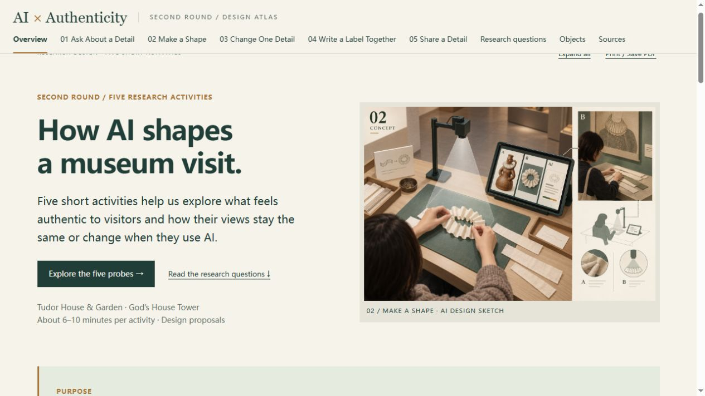

# AI × Authenticity · Five Probe Designs

[Open the live design atlas](https://jackson-jjc.github.io/probe_second-round_design/)

Updated 9 October 2026. These are static research proposals, not a working AI system.

## Why use these probes?

These five probes are short activities that help us explore how visitors experience authenticity when AI is part of a museum visit. We want to understand what that feeling is based on and how it stays the same or changes during an activity.

A probe gives visitors something to try, respond to and talk about. Here, authenticity means a real or meaningful connection with an object, its history, a place or other people. The homepage explains this purpose and shows all three research questions before the five activities.

## Five activities

1. **Ask About a Detail:** Choose a detail, ask AI about it, then write what you think.
2. **Make a Shape:** Make a shape with cloth or paper, photograph it, and tell AI what it missed about making it.
3. **Change One Detail:** Ask AI to change one detail in an object photo, then decide whether the result still feels connected to the object.
4. **Write a Label Together:** Write one line each about an object, let AI combine them, then decide what the shared label should say.
5. **Share a Detail:** Choose an object detail for a friend, let AI help word your message, then see how your friend responds.

Each page includes a design image, three screen sketches, a task for each target venue, a real museum example, camera and AI roles, and evidence to record.

## Research questions

**How does interacting with AI shape visitors’ experiences of authenticity in museums and heritage sites?**

- What do visitors rely on for a sense of authenticity during a museum or heritage visit that involves AI?
- How do visitors keep or change their understanding of authenticity as they interact with AI?

Full questions replace shorthand codes throughout the atlas. Plain-English explanations accompany them on the Research questions page.

## Objects and textiles

The target venues are **Tudor House & Garden** and **God’s House Tower**, Southampton.

- Tudor House: the Leather Jug and Bird Glass Panes are named official collection highlights. They are not textiles.
- GHT: the fabric wall hangings in Ian Giles’s *Everyone Involved* are the preferred textile candidate for four probes. The 2024 exhibition is verified, but GHT ownership and current access are not. One hanging must be selected with the venue and artist.
- Abraham Pether’s *God’s House Tower by Moonlight* is a historical loan candidate for image editing, not a GHT-owned collection object.
- No Chinese textile at either target venue was verified in the public records checked. This is not proof that none exists. A British–Chinese pair remains pending; no object from another museum has been substituted. See [the search record](collection_search.json).

## Open and rebuild

Open `index.html` directly, or run `python -m http.server 8766 --bind 127.0.0.1` from this directory and open `http://127.0.0.1:8766/`. No front-end dependencies are needed. Source photographs need internet access.

After editing the data, run `python build_atlas.py`. The compatibility command `python build_book.py` runs the same builder. It uses only the Python standard library and generates `index.html`, `DESIGN_NOTES.md` and `collection_sources.json`.

GitHub Pages serves the root of `main`. A successful push should trigger publication; check the Pages build before reporting a new version as live.

## Files

- `design_data.json`: short descriptions, steps and museum cases.
- `research_details.json`: full questions, methods, materials and limits.
- `venue_designs.json`: object records, venue tasks, camera plans and source images.
- `collection_search.json`: textile search scope, findings and remaining gaps.
- `styles.css` / `app.js`: responsive layout, page navigation, expand-all view, print support and image fallbacks.
- `assets/concept-01.png` to `assets/concept-05.png`: generated design sketches.
- `image_prompts.json`: original image-generation prompts.
- `DESIGN_NOTES.md`: full English notes.
- `validation.json`: checks performed for this revision.

## Image and study limits

Concept sketches do not establish an object’s appearance or material and do not show a working system. Some insets show earlier possible object choices; current task cards define the venue versions. Source photographs remain on their original websites with credits and links. Third-party photographs are not bundled in the repository.

Confirm object records, access, fact cards and image-use terms before a study. The atlas does not open a camera, call AI, track visitors or contain participant data. Example responses and timings are design suggestions, not measured results.
